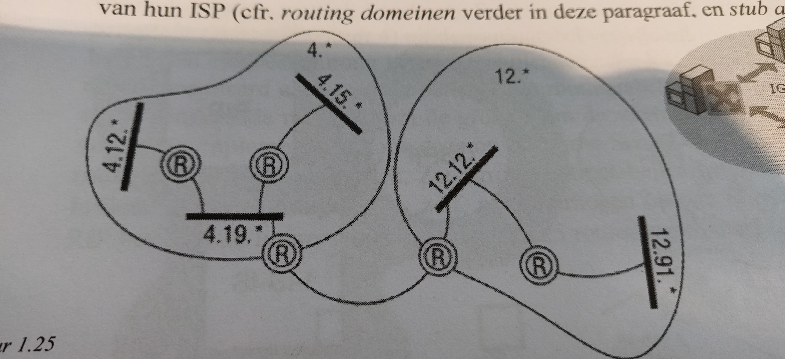
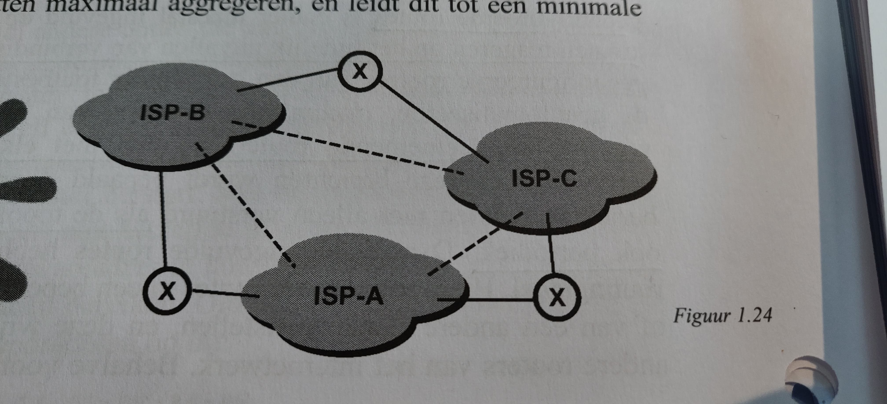

# 1.5 dynamische routing

## statische routing

* Meest efficiënte methode voor netwerken met een beperkt aantal routers en subnetwerken.

* Ze zijn weinig foutbestendig: Het **lifetime** veld is oneindig. Het bericht stopt nooit, het blijft rondspringen.Dus deze routers kunnen niet reageren op het tijdelijk uitvallen van verbindingen en/of andere routers.

----

## dynamische routing

* **routing protocol**: Bepaalt formaat en betekenis van de berichten die dynamische routers naar elkaar sturen. Door deze berichten blijft elke router up to date van enige wijzigingen in het netwerk.

* **lifetime** velden zijn dus beperkt.

* alleen initiële installatie daarna onderhoud het zichzelf.

* Vooral van toepassingen in grote netwerken.

* Veel bijkomend netwerkverkeer: word vermedem in WAN omgevingen.

----

## convergentie

Alle routingtabellen zijn correct ingevuld, stabiele toestand. Voor elke verbinding vindt men een optimaal pad.

**route flapping**: routers delen gegevens over gewijzigde routes.

**convergentie periode**: Hoe lang het duurt voor het netwerk om van een onstabiele toestand naar een stabiele terug te keren. Is afhankelijk van netwerk grootte, topologie,.... Tijdens deze periode kunnen er **black holes** en **routing loops** optreden.

----

## Autononous systems (AS)

Het internet word opgedeeld een meerdere **AS**'en. Elke **AS** is onder controle van een **ISP**.

De interne werking van **AS**'en zijn afgeschermd van elkander.

* De routers onder een **AS** delen al hun routing informatie.
* **AS**'en delen zo weinig mogelijk gedetailleerde informatie.
* Een **AS** aggregeerd zoveel mogelijk adressen onder globale adressen.
* Deze globale adressen worden geadverteerd naar andere **AS**'en.
* Deze gobale adressen komen niet overeen met adressen uit een subnet van andere **AS**'en.

### **regional peering points** of **regional exchanges**

aangeduid met stippelijn op afbeelding

contactpunten voor de **Tier-1 ISPs**. Geen vaste eignaar, niemandsland.

### **private peering points**

aangeduid met X op afbeelding

Voor **AS**' om onderling informatie uit te wisselen.

### lower tier ISP

communiceren met elkander via **regional peering points**, of betalen voor de diensten van **ISP** met hogere tier.

----

## gateway protocols

### exterior gateway protocol (EGP) of intra-domain protocol

Voor routers die **AS**'en onderling zijn verbonden. Deelt routing informatie.

Soorten: **Gateway to gateway protocol**, **Border gateway protocol**

#### BPG routing policy:

* houdt rekening met commercië en politieke overeenkomsten. Tov **IGP** dat alleen rekening houdt met het meest optimale pad.
* Kan bepaald verkeer blokkeren voor censuur.

#### Border gateway protocol(BGPv4)

* internet gebruikt uitsluitend BGP.
* Vereist dat elke **AS** een **ASN** (Autonomous System Number) heeft.
* Ondernemingen die met meerder **ISP**'s verbinden moeten **BGPv4** ondersteunen en een **ASN** aanvragen.

### Interior gateway protocol (IGP)

#### IGP routing policy:

* zoekt meest optimale pad met laagste kost.
* Verspreid routing info over het **AS**.

Soorten: **Routing Information Protocol (RIP)**, **Enhanced Interior Gateway Routing Protocol (E-IGRP)**, **Open Shortest Path First (OSPF)**, **Intermediate System to Indermediate System (IS-IS)**

### Routing domein

Netwerkbeheerders kunnen netwerken onder een **AS** onderverdelen in meerdere subnetten. Deze subnettten delen informatie op basis van hetzelfde **IGP**.

Klanten van een ***ISP** vormen ook vaan routing domeinen in het **AS** van de **ISP**.

### technologieën

#### distance vector

word gebruikt door **BGPv4**

#### link state

Word verder besproken in 1.6 en 1.8.
