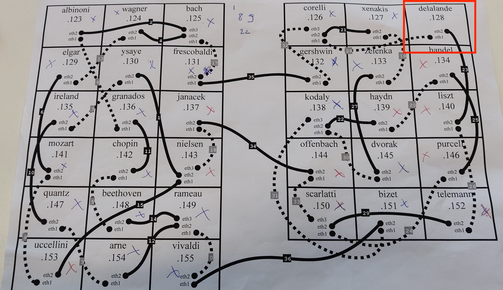
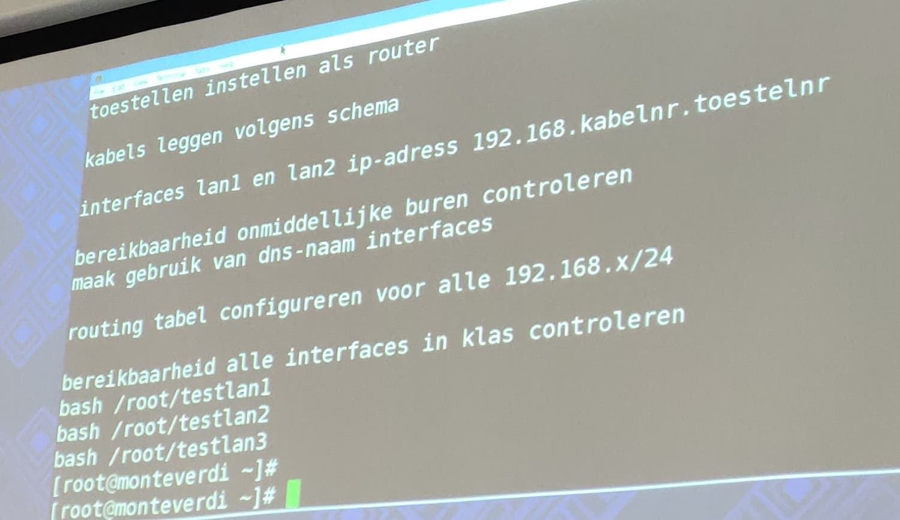

# labo 2 Computer netwerken

De huidige host is Delalande.
Eth op het blad moet lan zijn.





## Toestellen instellen als router

### Router omzetten

Om host tijdelijk om te zetten naar een router:

```bash
sysctl -w net.ipv4.ip_forward=1
```

of

```bash
echo 1 > /proc/sys/net/ipv4/ip_forward
```

Om permanent om te zetten:

```bash
cat /etc/sysconfig/network
NETWORKING=yes
FORWARD_IPV4=no
HOSTNAME=<hostname>
GATEWAYDEV=
GATEWAY=
```

naar

```bash
cat /etc/sysconfig/network
NETWORKING=yes
FORWARD_IPV4=yes
HOSTNAME=<hostname>
GATEWAYDEV=
GATEWAY=
```

## kabels leggen volgens schema

Dit spreekt voor zichzelf.

## interfaces lan1 en lan2 ip-adres 192.168.kabelnr.toestelnr

### Interfaces checken

Eerst checken we met ifconfig of alle interfaces aanstaan.

```bash
ifconfig
```

output (niet exact correct, dient gewoon als voorbeeld):

```bash
lo0: flags=8049<UP,LOOPBACK,RUNNING,MULTICAST> mtu 16384
	options=1203<RXCSUM,TXCSUM,TXSTATUS,SW_TIMESTAMP>
	inet 127.0.0.1 netmask 0xff000000
	inet6 ::1 prefixlen 128
	inet6 fe80::1%lo0 prefixlen 64 scopeid 0x1
	nd6 options=201<PERFORMNUD,DAD>
lan0: flags=8049<UP,RUNNING,MULTICAST> mtu 16384
	options=1203<RXCSUM,TXCSUM,TXSTATUS,SW_TIMESTAMP>
	inet 127.0.0.1 netmask 0xff000000
	inet6 ::1 prefixlen 128
	inet6 fe80::1%lo0 prefixlen 64 scopeid 0x1
	nd6 options=201<PERFORMNUD,DAD>
```

lan0 dient voor de DNS server en lo0 is de loopback.
We zien dat lan1 en lan2 niet aanstaan.

### Interfaces aanzetten

interfaces lan1 en lan2 moeten worden geactiveerd.

```bash
ifconfig lan1 up
ifconfig lan2 up
```

### gateways instellen

De routers Corelli en List worden gekozen als gateway omdat deze rechtstreeks zijn verbonden met onze host.
Interfaces moeten aan en uit worden gezet om hun ip-adressen in te stellen.

```bash
ifconfig lan1 down
ip addr 192.168.28.128/24 dev eth1
ifconfig lan1 up


ifconfig lan2 down
ip addr 192.168.23.128/24 dev eth2
ifconfig lan1 down
```

adress is 192.168.[kabel-nummer].[host-adress]

* kabel-nummer is het nummer van de kabel die de huidge host verbindt met de gateway (28 en 23).
* host-adress is het adres van de huidige host (128).

## bereikbaarheid onmiddelijke buren controlen, maak gebruik van dsn-naam interfaces

Gebruik ping om de gateways te testen.

```bash
ping [<IP-adress>|<DNS-naam><interface-nummer>]
```

Bijvoorbeeld:

```bash
ping liszt2
```

of

```bash
ping 192.168.23.140
```

## routing table configureren voor alle 192.168.x/24

### Routing tabel instellen

De host Delalande heeft 2 gateways, dus om alle andere routers te bereiken moet die eerst langs de gateways passeren.
De keuze van de gateway is dus afhankelijk van hoe dicht de doelhost zich bij de gateway bevindt.
Op het oefenblad zien we bijvoorbeeld dat de router Xenakis zich dichter bij Corelli dan bij Liszt bevindt.

Voor een pad langs Corelli (192.168.28.126):

```bash
route add -net 192.168.<kabel-nummer>.0/24 gw 192.168.28.126
```

Voor een pad langs Liszt (192.168.23.140):

```bash
route add -net 192.168.<kabel-nummer>.0/24 gw 192.168.23.140
```

De IP's waarmee worden verbonden (192.168.\<kabel-nummer>.0) eindigen met 0 omdat men altijd verbind met een subnetwerk.

Om de route-tabel na te kijken gebruikt men het commando:

```bash
ip r
```

In geval van een fout kan men de route verwijderen met:

```bash
route del -net 192.168.<kabel-nummer>.0/24 gw 192.168.23.140
```

Men kan ook de route plaatsen in een file met:

```bash
ip r > t
```

De routes kunnen dan rechtstreeks worden gewijzigd:

```bash
vim t
```

en worden opgeslagen in het systeem:
(OPGEPAST niet zeker of de locatie /etc/sysconfig/static-routes correct is)

```bash
mv t /etc/sysconfig/static-routes
```

Tijdens het instellen van de tabellen ondervond iedereen dat er veel loops in het netwerk zaten.
Het doel van het labo was om aan te tonen dat dynamisch instellen veel makkelijker is.

### routes testen

Gebruik ping om te zien of de host word bereikt.

```bash
ping [<IP-adress>|<DNS-naam><interface-nummer>]
```

Gebruik traceroute om te zien waar het pad fout loopt of waar er loops zijn.

```bash
traceroute [<IP-adress>|<DNS-naam><interface-nummer>]
```
