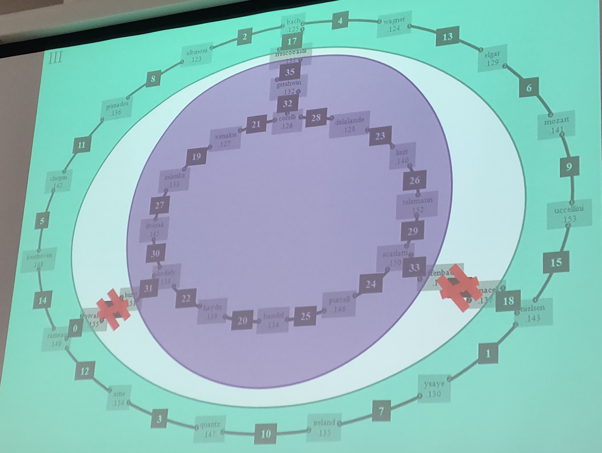

# dynamische routing

Hieronder is een afbeelding van dezelfde netwerkstructuur als vorige week maar meer logisch geordend.


## dynamische routing op windows: RIP

In het begin werd over het gehele lokaal **RIP** ingesteld voor windows.
Daarna werden er 2 kabels 'doorgeknipt'.


Het netwerk zou normaal gezien moeten werken.
Maar de paketten die langs granados en chopin passeerde kregen een metriek van 16.
Het pad werd hier onderbroken en werd geen directe oplossing gevonden.

## dynamische routing op linux: RIP en OSPFD

Origineel was de bedoeling van deze opdracht om windows routers met linux routers te verbinden.
Maar een deel van de windows servers wouden niet werken vanwege een fout in hun RIP configuratie.

**RIPD** werd alleen over een specifiek veld ingesteld. De rest van de klas verzamelde rond de computers bestemd voor ripd om ze in te stellen. Hieronder het specifieke ripd veld.


### network interface configuratie

Dit werd al in het vorige labo uitgevoerd. Kijk daar voor meer uitleg.

```bash
ifconfig lan1 192.168.28.128 up
ifconfig lan1 192.168.23.128 up
```

Om te testen:

```bash
ping corelli1
ping liszt2
```

Om als router in te stellen

```bash
sysctl -w net.ipv4.ip_forward=1
```

### daemons opstarten

Linux gebruikt verschillende Daemons om de routingprotocollen ( **RIP** en **OSPF** ) te installeren en te onderhouden.

**Zebra** is een routing software package dat TCP/IP based routing ondersteund voor verschillende routing protocols, net name **RIP**, **OSPF** en **BPG**.

Voor dit labo word gebruikt gemaakt van **Quagga** een fork van **Zebra**.

De configuratie van de **RIP** en **OSPF** daemons vindt men onder:

```bash
> cd ~/etc/quagga
> ls
zebra.conf
ripd.conf
ospfd.conf
```

In deze files vindt men:

```bash
> vim ripd.conf ospfd.conf zebra.conf
hostname localhost # naam van de terminal als ge verbindt met de terminal
password x # wachtwoord om met de service te verbinden
enable password x # wachtwoord om admin privileges te krijgen in de service
line vty # Dit stukt dient om te voorkomen dat de terminal afsluit als met de service word verbonden.
    exec-timeout 0 0
```

De files ripd.conf en ospfd.conf worden omgezet naar:

```bash
> vim ripd.conf ospfd.conf
hostname delalande # Niet verplicht. Dient voor leesbaarheid.
password x
enable password x
line vty 
    exec-timeout 0 0
```

Opstarten van de services:

```bash
systemctl restart zebra
systemctl restart ripd
systemctl restart ospfd
```

Status van de daemons checken:

```bash
pgrep -a zebra
pgrep -a ripd
pgrep -a opsfd
```

### ripd configureren

Deze configuratie is vanuit het perspectief van delalande.
Verbinden met de ripd services:

```bash
telnet localhost ripd
```

Wachtwoord:

```bash
password: x
delalande>
```

Admin privileges:

```bash
delalande> enable
password: x
delalande#
```

Voor hulp te krijgen in deze terminal:

```bash
delalande# ?
```

Om configure terminal te openen:

```bash
delalande# configure terminal
```

voor rip config te openen:

```bash
delalande(config)# router rip
delalande(config-router)#
```

Om de ip routes van in de kernel toe te voegen aan de rip service.

```bash
delalande(config-router)# redistribute kernel
delalande(config-router)# redistribute connected
delalande(config-router)# redistribute static
```

Om de interfaces in te stellen voor rip.
In dit commando moeten we alleen de benaming van de interfaces instellingen.
Niet de IP-adressen van deze interfaces.

```bash
delalande(config-router)# net lan1
delalande(config-router)# net lan2
```

Toont de huidige config voor rip:

```bash
delalande(config-router)# show running config
```

Nu is de config ingesteld maar nog niet permanent opgeslagen.
Bij het heropstarten moeten we de config opnieuw instellen.
Om de config permanent op te slaan.

```bash
delalande(config-router)# wr
```

Om terug te keren naar originele telnet terminal.

```bash
delalande(config-router)# q
delalande(config)# q
delalande#
```

Om te zien welke routes **RIP** al heeft gevonden.

```bash
delalande(config-router)# show ip rip
```

Om de **RIP neighbours** te zien.

```bash
delalande(config-router)# show ip rip status
```

### opsfd configureren

Deze configuratie is vanuit het perspectief van frescobaldi.
Gelijkaardig aan ripd dus een groot deel van de commando's ga ik overslaan.
Hieronder een afbeelding van de computers die **ospfd** moeten instellen.
Dit veld heeft als area code **0.0.0.1**.



Frescobaldi is een uitzondering in dit netwerk veld en moet zowel ospfd als ripd instellen. Hier zien we alleen de config van ospfd.

Voor de initiële config:

```bash
telnet localhost ospfd
ww: x
frescobaldi> enable
ww: x
frescobaldi# configure terminal
frescobaldi(config)# router ospfd
frescobaldi(config-router)# router ospfd
frescobaldi(config-router)# redistribute kernel
frescobaldi(config-router)# redistribute connected
frescobaldi(config-router)# redistribute static
```

Om de interfaces in te stellen.
Hierbij moeten we de subnet adressen van de interfaces gebruiken en daarnaast de area code plaatsen:

```bash
frescobaldi(config-router)# net 192.168.17.00/24 area 0.0.0.1
```

Om uit de configure terminals te gaan.

```bash
frescobaldi(config-router)# q
frescobaldi(config)# q
frescobaldi#
```

Om de interfaces te bekijken:

```bash
frescobaldi# sh ip ospf i
```

Om de routes te bekijken:

```bash
frescobaldi# sh ip ospf r
```

### We zetten het gehele netwerkveld om naar OSPFD

Het originele **RIP** veld word nu area 0.0.0.2 onder ospfd. De commandos zijn vanuit het standpunt van frescobaldi.


Deze commando's delen alle routes gevonden door rip en ospf met elkander.

**OSPF**:

```bash
frescobaldi(config-router)# redistribute rip
```

**RIP**:

```bash
frescobaldi(config-router)# redistribute ospf
```

We verwijderen de **RIP** interfaces:

```bash
frescobaldi(config-router)# no network lan1
```

We kijken of het echt is verwijderd:

```bash
frescobaldi(config-router)# sh ip rip
```

We stoppen ripd:

```bash
systemctl stop ripd
```

We kijken of het echt is verwijderd.

```bash
pgrep -a ripd
```

We maken een nieuw **OSPF** area: **0.0.0.2**:

```bash
frescobaldi(config-router)# net 192.168.35.00/24 area 0.0.0.2
```

### Het lukt niet om de 2 areas te verbinden

We hebben nog een backbone nodig.
Dit is een **OSPF** area met code **0.0.0.0**.
Zie geel veld in onderstaande afbeelding, dit zijn frescobaldi en gershwin.


Vanuit frescobaldi:

```bash
net 192.168.35.0 area 0.0.0.0
```

Vanuit gershwin:

```bash
net 192.168.35.0 area 0.0.0.0
```

### Hoe verbinden we verschillende soorten ospf technologieën?

Wat als we in de buitenste ring ospf van quagga pakken en xorp ospf voor de binnenste ring pakken?

quagga zet de cost van hun routers default op 10.
xorp zet het op 1.

Dus als ze van Arne naar ysaye een bericht willen sturen dan gaat het deze weg pakken.
De kabels zijn in dit voorbeeld niet doorgeknipt.


We moeten dan voor elke quagga router de kost gelijkstellen aan 1.
Zodat deze gelijkstaat aan de xorp routers:

```bash
frescobaldi(config)# int lan1
frescobaldi(config-if)# ospf cost 1
frescobaldi(config-if)# q
frescobaldi(config)# int lan2
frescobaldi(config-if)# ospf cost 1
```

Heironder het resultaat:


